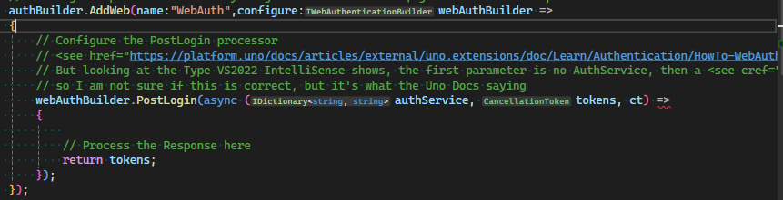

# DevTKSS.MyManufacturerERP.Server

This document contains additional references and known issues related to the DevTKSS.MyManufacturerERP project, particularly focusing on the Uno Platform and its integration with ASP.NET Core Identity.

## Table of Contents

1. [Issues](#issues)
   - 1.1 [Workarounds](#workarounds)
   - 1.2 [Uno Platform Documentation Problems](#uno-platform-documentation-problems)
   - 1.3 [Authentication & Server Issues](#authentication--server-issues)
2. [Useful References](#useful-references)
3. [Documentation & Learning References](#documentation--learning-references)
4. [API Documentation & Services](#api-documentation--services)
5. [CORS & WebAssembly](#cors--webassembly)

---

## Issues

### Workarounds

- [Uno Platform GitHub Issue #20546](https://github.com/unoplatform/uno/issues/20546) - String TypeInfo serialization

### Uno Platform Documentation Problems

- [Uno Platform Post-Login Token Processing](https://platform.uno/docs/articles/external/uno.extensions/doc/Learn/Authentication/HowTo-WebAuthentication.html#4-process-post-login-tokens) - Process post-login tokens
  while the docs are introducing us to do this for web auth, [this is not working as documented](./DevTKSS.MyManufacturerERP/App.xaml.cs#L116)

  ```bash
  CS1593
  Delegate "AsyncFunc<IDictionary<string, string>, IDictionary<string, string>?>" does not accept 3 arguments.
  DevTKSS.MyManufacturerERP (net9.0-browserwasm)
  C:\Users\Sonja\source\sample apps\DevTKSS.MyManufacturerERP\DevTKSS.MyManufacturerERP\App.xaml.cs 116
  ```
  ]

- [Uno Platform Cookie Authentication](https://platform.uno/docs/articles/external/uno.extensions/doc/Learn/Authentication/HowTo-Cookies.html) - Configure cookie options

  This is missing kind of all docs about working with cookies. The provided links are not very helpfull for learning only if you might not know the words, but still you will not know how to use that in development.

### Authentication & Server Issues

- Splashscreen not disapears targeting WASM, while targeting Desktop the Login button does only open a browser with no connection to the server
- Server startup problems when clicking "Login" button in client application
- Port configuration conflicts between WebAssembly and Server targets
- Missing Identity API endpoints in Endpoint Explorer
- Delegate signature mismatch in Uno Platform authentication [CS1593 error](#uno-platform-documentation-problems)
  -> Commented out now until some fix is known
- Web Socket Error in ws_wasm_create:

  ```
  Verbose logs are written to:
  C:\Users\Sonja\AppData\Local\Temp\visualstudio-js-debugger.txt
  Das Programm "service-worker.js" wurde mit Code 4294967295 (0xffffffff) beendet.
  Setting DOTNET_MODIFIABLE_ASSEMBLIES=debug
  Setting UNO_BOOTSTRAP_MONO_RUNTIME_MODE=Interpreter
  Setting UNO_BOOTSTRAP_MONO_PROFILED_AOT=False
  Setting UNO_BOOTSTRAP_LINKER_ENABLED=False
  Setting UNO_BOOTSTRAP_DEBUGGER_ENABLED=True
  Setting UNO_BOOTSTRAP_MONO_RUNTIME_CONFIGURATION=Release
  Setting UNO_BOOTSTRAP_MONO_RUNTIME_FEATURES=
  Setting UNO_BOOTSTRAP_APP_BASE=package_21b5f74264dfbde23ef8f426f23aa85db3d9f0e8
  Setting UNO_BOOTSTRAP_WEBAPP_BASE_PATH=/
  dotnet Loaded 101.81 MB resources
  This application was built with linking (tree shaking) disabled. 
  Published applications will be significantly smaller if you install wasm-tools workload. 
  See also https://aka.ms/dotnet-wasm-features
  Loaded 101.81 MB resources from cache
  Debugging hotkey: Shift+Alt+D (when application has focus)
  Active service worker found, skipping register
  MONO_WASM: WebSocket error in ws_wasm_create: SecurityError: Failed to construct 'WebSocket': An insecure WebSocket connection may not be initiated from a page loaded over HTTPS.
  MONO_WASM: Assert failed: ERR18: expected ws instance Error: Assert failed: ERR18: expected ws instance
  MONO_WASM: Assert failed: .NET runtime already exited with 1 Error: Assert failed: ERR18: expected ws instance. You can use runtime.runMain() which doesn't exit the runtime. Error: Assert failed: .NET runtime already exited with 1 Error: Assert failed: ERR18: expected ws instance. You can use runtime.runMain() which doesn't exit the runtime.
  MONO_WASM: Assert failed: .NET runtime already exited with 1 Error: Assert failed: .NET runtime already exited with 1 Error: Assert failed: ERR18: expected ws instance. You can use runtime.runMain() which doesn't exit the runtime.. You can use runtime.runMain() which doesn't exit the runtime. Error: Assert failed: .NET runtime already exited with 1 Error: Assert failed: .NET runtime already exited with 1 Error: Assert failed: ERR18: expected ws instance. You can use runtime.runMain() which doesn't exit the runtime.. You can use runtime.runMain() which doesn't exit the runtime.
  Uncaught Error Error: Assert failed: .NET runtime already exited with 1 Error: Assert failed: ERR18: expected ws instance. You can use runtime.runMain() which doesn't exit the runtime.
    at Ke (c:\Users\Sonja\source\sample apps\DevTKSS.MyManufacturerERP\DevTKSS.MyManufacturerERP\_framework\https:\raw.githubusercontent.com\dotnet\runtime\3c298d9f00936d651cc47d221762474e25277672\src\mono\browser\runtime\loader\globals.ts:148:19)
    at tt (c:\Users\Sonja\source\sample apps\DevTKSS.MyManufacturerERP\DevTKSS.MyManufacturerERP\_framework\https:\raw.githubusercontent.com\dotnet\runtime\3c298d9f00936d651cc47d221762474e25277672\src\mono\browser\runtime\loader\exit.ts:18:190)
    at dr (c:\Users\Sonja\source\sample apps\DevTKSS.MyManufacturerERP\DevTKSS.MyManufacturerERP\_framework\https:\raw.githubusercontent.com\dotnet\runtime\3c298d9f00936d651cc47d221762474e25277672\src\mono\browser\runtime\invoke-js.ts:484:19)
    at Cr (c:\Users\Sonja\source\sample apps\DevTKSS.MyManufacturerERP\DevTKSS.MyManufacturerERP\_framework\https:\raw.githubusercontent.com\dotnet\runtime\3c298d9f00936d651cc47d221762474e25277672\src\mono\browser\runtime\gc-handles.ts:74:5)
    at ho (c:\Users\Sonja\source\sample apps\DevTKSS.MyManufacturerERP\DevTKSS.MyManufacturerERP\_framework\https:\raw.githubusercontent.com\dotnet\runtime\3c298d9f00936d651cc47d221762474e25277672\src\mono\browser\runtime\marshal-to-cs.ts:349:31)
    at <anonymous> (c:\Users\Sonja\source\sample apps\DevTKSS.MyManufacturerERP\DevTKSS.MyManufacturerERP\_framework\https:\raw.githubusercontent.com\dotnet\runtime\3c298d9f00936d651cc47d221762474e25277672\src\mono\browser\runtime\invoke-js.ts:244:13)
    at Fc (c:\Users\Sonja\source\sample apps\DevTKSS.MyManufacturerERP\DevTKSS.MyManufacturerERP\_framework\https:\raw.githubusercontent.com\dotnet\runtime\3c298d9f00936d651cc47d221762474e25277672\src\mono\browser\runtime\invoke-js.ts:78:5)
    at $do_icall (wasm/dotnet.native.wasm-06346286.wat:533859:1)
    at $do_icall_wrapper (wasm/dotnet.native.wasm-06346286.wat:527254:1)
    at $mono_interp_exec_method (wasm/dotnet.native.wasm-06346286.wat:498990:1)
    at $interp_runtime_invoke (wasm/dotnet.native.wasm-06346286.wat:529486:1)
    at $mono_jit_runtime_invoke (wasm/dotnet.native.wasm-06346286.wat:1019976:1)
    at $do_runtime_invoke (wasm/dotnet.native.wasm-06346286.wat:913031:1)
    at $mono_runtime_try_invoke (wasm/dotnet.native.wasm-06346286.wat:914104:1)
    at $mono_runtime_invoke (wasm/dotnet.native.wasm-06346286.wat:918965:1)
    at $mono_wasm_invoke_jsexport (wasm/dotnet.native.wasm-06346286.wat:4373498:1)
    at <anonymous> (localhost꞉5001/_framework/dotnet.native.vh2bwj4kkt.js:812:12)
    at ccall (localhost꞉5001/_framework/dotnet.native.vh2bwj4kkt.js:10469:17)
    at <anonymous> (localhost꞉5001/_framework/dotnet.native.vh2bwj4kkt.js:10487:27)
    at hn (c:\Users\Sonja\source\sample apps\DevTKSS.MyManufacturerERP\DevTKSS.MyManufacturerERP\_framework\https:\raw.githubusercontent.com\dotnet\runtime\3c298d9f00936d651cc47d221762474e25277672\src\mono\browser\runtime\managed-exports.ts:280:16)
    at <anonymous> (c:\Users\Sonja\source\sample apps\DevTKSS.MyManufacturerERP\DevTKSS.MyManufacturerERP\_framework\https:\raw.githubusercontent.com\dotnet\runtime\3c298d9f00936d651cc47d221762474e25277672\src\mono\browser\runtime\managed-exports.ts:65:9)
    at Pc (c:\Users\Sonja\source\sample apps\DevTKSS.MyManufacturerERP\DevTKSS.MyManufacturerERP\_framework\https:\raw.githubusercontent.com\dotnet\runtime\3c298d9f00936d651cc47d221762474e25277672\src\mono\browser\runtime\run.ts:71:22)
    --- await ---
    at mainInit (localhost꞉5001/package_21b5f74264dfbde23ef8f426f23aa85db3d9f0e8/uno-bootstrap.js:267:30)
    --- await ---
    at checkDone (localhost꞉5001/package_21b5f74264dfbde23ef8f426f23aa85db3d9f0e8/uno-bootstrap.js:369:38)
    at processDependency (localhost꞉5001/package_21b5f74264dfbde23ef8f426f23aa85db3d9f0e8/uno-bootstrap.js:387:37)
    at execCb (localhost꞉5001/package_21b5f74264dfbde23ef8f426f23aa85db3d9f0e8/require.js:5:16727)
    at check (localhost꞉5001/package_21b5f74264dfbde23ef8f426f23aa85db3d9f0e8/require.js:5:10499)
    at <anonymous> (localhost꞉5001/package_21b5f74264dfbde23ef8f426f23aa85db3d9f0e8/require.js:5:12915)
    at <anonymous> (localhost꞉5001/package_21b5f74264dfbde23ef8f426f23aa85db3d9f0e8/require.js:5:1542)
    at <anonymous> (localhost꞉5001/package_21b5f74264dfbde23ef8f426f23aa85db3d9f0e8/require.js:5:13376)
    at each (localhost꞉5001/package_21b5f74264dfbde23ef8f426f23aa85db3d9f0e8/require.js:5:1020)
    at emit (localhost꞉5001/package_21b5f74264dfbde23ef8f426f23aa85db3d9f0e8/require.js:5:13344)
    at check (localhost꞉5001/package_21b5f74264dfbde23ef8f426f23aa85db3d9f0e8/require.js:5:11058)
    at enable (localhost꞉5001/package_21b5f74264dfbde23ef8f426f23aa85db3d9f0e8/require.js:5:13242)
    at init (localhost꞉5001/package_21b5f74264dfbde23ef8f426f23aa85db3d9f0e8/require.js:5:9605)
    at a (localhost꞉5001/package_21b5f74264dfbde23ef8f426f23aa85db3d9f0e8/require.js:5:8305)
    at completeLoad (localhost꞉5001/package_21b5f74264dfbde23ef8f426f23aa85db3d9f0e8/require.js:5:16151)
    at onScriptLoad (localhost꞉5001/package_21b5f74264dfbde23ef8f426f23aa85db3d9f0e8/require.js:5:16882)
    --- script ---
    at <anonymous> (localhost꞉5001/package_21b5f74264dfbde23ef8f426f23aa85db3d9f0e8/require.js:5:3095)
    at <anonymous> (localhost꞉5001/package_21b5f74264dfbde23ef8f426f23aa85db3d9f0e8/require.js:5:3272)
    at load (localhost꞉5001/package_21b5f74264dfbde23ef8f426f23aa85db3d9f0e8/require.js:5:16680)
    at load (localhost꞉5001/package_21b5f74264dfbde23ef8f426f23aa85db3d9f0e8/require.js:5:10087)
    at fetch (localhost꞉5001/package_21b5f74264dfbde23ef8f426f23aa85db3d9f0e8/require.js:5:9888)
    at check (localhost꞉5001/package_21b5f74264dfbde23ef8f426f23aa85db3d9f0e8/require.js:5:11152)
    at enable (localhost꞉5001/package_21b5f74264dfbde23ef8f426f23aa85db3d9f0e8/require.js:5:13242)
    at enable (localhost꞉5001/package_21b5f74264dfbde23ef8f426f23aa85db3d9f0e8/require.js:5:15790)
    at <anonymous> (localhost꞉5001/package_21b5f74264dfbde23ef8f426f23aa85db3d9f0e8/require.js:5:13099)
    at <anonymous> (localhost꞉5001/package_21b5f74264dfbde23ef8f426f23aa85db3d9f0e8/require.js:5:1542)
    at each (localhost꞉5001/package_21b5f74264dfbde23ef8f426f23aa85db3d9f0e8/require.js:5:1020)
    at enable (localhost꞉5001/package_21b5f74264dfbde23ef8f426f23aa85db3d9f0e8/require.js:5:12599)
    at init (localhost꞉5001/package_21b5f74264dfbde23ef8f426f23aa85db3d9f0e8/require.js:5:9605)
    at <anonymous> (localhost꞉5001/package_21b5f74264dfbde23ef8f426f23aa85db3d9f0e8/require.js:5:15109)
    --- setTimeout ---
    at <anonymous> (localhost꞉5001/package_21b5f74264dfbde23ef8f426f23aa85db3d9f0e8/require.js:5:2434)
    at s (localhost꞉5001/package_21b5f74264dfbde23ef8f426f23aa85db3d9f0e8/require.js:5:15048)
    at requirejs (localhost꞉5001/package_21b5f74264dfbde23ef8f426f23aa85db3d9f0e8/require.js:5:2335)
    at require (localhost꞉5001/package_21b5f74264dfbde23ef8f426f23aa85db3d9f0e8/uno-bootstrap.js:412:25)
    at <anonymous> (localhost꞉5001/package_21b5f74264dfbde23ef8f426f23aa85db3d9f0e8/uno-bootstrap.js:390:34)
    at initializeRequire (localhost꞉5001/package_21b5f74264dfbde23ef8f426f23aa85db3d9f0e8/uno-bootstrap.js:372:58)
    at RuntimeReady (localhost꞉5001/package_21b5f74264dfbde23ef8f426f23aa85db3d9f0e8/uno-bootstrap.js:213:26)
    at Bootstrapper.onDotnetReady (localhost꞉5001/package_21b5f74264dfbde23ef8f426f23aa85db3d9f0e8/uno-bootstrap.js:124:53)
    at <anonymous> (c:\Users\Sonja\source\sample apps\DevTKSS.MyManufacturerERP\DevTKSS.MyManufacturerERP\_framework\https:\raw.githubusercontent.com\dotnet\runtime\3c298d9f00936d651cc47d221762474e25277672\src\mono\browser\runtime\startup.ts:451:30)
    at <anonymous> (c:\Users\Sonja\source\sample apps\DevTKSS.MyManufacturerERP\DevTKSS.MyManufacturerERP\_framework\https:\raw.githubusercontent.com\dotnet\runtime\3c298d9f00936d651cc47d221762474e25277672\src\mono\browser\runtime\startup.ts:351:15)
  Uncaught Error Error: Assert failed: .NET runtime already exited with 1 Error: Assert failed: .NET runtime already exited with 1 Error: Assert failed: ERR18: expected ws instance. You can use runtime.runMain() which doesn't exit the runtime.. You can use runtime.runMain() which doesn't exit the runtime.
    at Ke (c:\Users\Sonja\source\sample apps\DevTKSS.MyManufacturerERP\DevTKSS.MyManufacturerERP\_framework\https:\raw.githubusercontent.com\dotnet\runtime\3c298d9f00936d651cc47d221762474e25277672\src\mono\browser\runtime\loader\globals.ts:148:19)
    at tt (c:\Users\Sonja\source\sample apps\DevTKSS.MyManufacturerERP\DevTKSS.MyManufacturerERP\_framework\https:\raw.githubusercontent.com\dotnet\runtime\3c298d9f00936d651cc47d221762474e25277672\src\mono\browser\runtime\loader\exit.ts:18:190)
    at dr (c:\Users\Sonja\source\sample apps\DevTKSS.MyManufacturerERP\DevTKSS.MyManufacturerERP\_framework\https:\raw.githubusercontent.com\dotnet\runtime\3c298d9f00936d651cc47d221762474e25277672\src\mono\browser\runtime\invoke-js.ts:484:19)
    at yr (c:\Users\Sonja\source\sample apps\DevTKSS.MyManufacturerERP\DevTKSS.MyManufacturerERP\_framework\https:\raw.githubusercontent.com\dotnet\runtime\3c298d9f00936d651cc47d221762474e25277672\src\mono\browser\runtime\invoke-cs.ts:376:5)
    at initializeExports (localhost꞉5001/package_21b5f74264dfbde23ef8f426f23aa85db3d9f0e8/Uno.Wasm.js:65:57)
    at <anonymous> (localhost꞉5001/package_21b5f74264dfbde23ef8f426f23aa85db3d9f0e8/Uno.Wasm.js:52:47)
    at run (localhost꞉5001/package_21b5f74264dfbde23ef8f426f23aa85db3d9f0e8/setImmediate.js:46:17)
    at runIfPresent (localhost꞉5001/package_21b5f74264dfbde23ef8f426f23aa85db3d9f0e8/setImmediate.js:75:21)
    at onGlobalMessage (localhost꞉5001/package_21b5f74264dfbde23ef8f426f23aa85db3d9f0e8/setImmediate.js:115:17)
    --- postMessage ---
    at registerImmediate (localhost꞉5001/package_21b5f74264dfbde23ef8f426f23aa85db3d9f0e8/setImmediate.js:126:20)
    at setImmediate (localhost꞉5001/package_21b5f74264dfbde23ef8f426f23aa85db3d9f0e8/setImmediate.js:33:9)
    at <anonymous> (localhost꞉5001/package_21b5f74264dfbde23ef8f426f23aa85db3d9f0e8/Uno.Wasm.js:51:92)
    at initialize (localhost꞉5001/package_21b5f74264dfbde23ef8f426f23aa85db3d9f0e8/Uno.Wasm.js:51:62)
    at <anonymous> (c:\Users\Sonja\source\sample apps\DevTKSS.MyManufacturerERP\DevTKSS.MyManufacturerERP\_framework\https:\raw.githubusercontent.com\dotnet\runtime\3c298d9f00936d651cc47d221762474e25277672\src\mono\browser\runtime\invoke-js.ts:222:13)
    at Fc (c:\Users\Sonja\source\sample apps\DevTKSS.MyManufacturerERP\DevTKSS.MyManufacturerERP\_framework\https:\raw.githubusercontent.com\dotnet\runtime\3c298d9f00936d651cc47d221762474e25277672\src\mono\browser\runtime\invoke-js.ts:78:5)
    at $do_icall (wasm/dotnet.native.wasm-06346286.wat:533859:1)
    at $do_icall_wrapper (wasm/dotnet.native.wasm-06346286.wat:527254:1)
    at $mono_interp_exec_method (wasm/dotnet.native.wasm-06346286.wat:498990:1)
    at $interp_runtime_invoke (wasm/dotnet.native.wasm-06346286.wat:529486:1)
    at $mono_jit_runtime_invoke (wasm/dotnet.native.wasm-06346286.wat:1019976:1)
    at $do_runtime_invoke (wasm/dotnet.native.wasm-06346286.wat:913031:1)
    at $mono_runtime_try_invoke (wasm/dotnet.native.wasm-06346286.wat:914104:1)
    at $mono_runtime_class_init_full (wasm/dotnet.native.wasm-06346286.wat:913467:1)
    at $mono_interp_transform_method (wasm/dotnet.native.wasm-06346286.wat:566338:1)
    at $do_transform_method (wasm/dotnet.native.wasm-06346286.wat:526045:1)
    at $mono_interp_exec_method (wasm/dotnet.native.wasm-06346286.wat:525704:1)
    at $interp_runtime_invoke (wasm/dotnet.native.wasm-06346286.wat:529486:1)
    at $mono_jit_runtime_invoke (wasm/dotnet.native.wasm-06346286.wat:1019976:1)
    at $do_runtime_invoke (wasm/dotnet.native.wasm-06346286.wat:913031:1)
    at $mono_runtime_try_invoke (wasm/dotnet.native.wasm-06346286.wat:914104:1)
    at $mono_runtime_invoke (wasm/dotnet.native.wasm-06346286.wat:918965:1)
    at $mono_wasm_invoke_jsexport (wasm/dotnet.native.wasm-06346286.wat:4373498:1)
    at <anonymous> (localhost꞉5001/_framework/dotnet.native.vh2bwj4kkt.js:812:12)
    at ccall (localhost꞉5001/_framework/dotnet.native.vh2bwj4kkt.js:10469:17)
    at <anonymous> (localhost꞉5001/_framework/dotnet.native.vh2bwj4kkt.js:10487:27)
    at hn (c:\Users\Sonja\source\sample apps\DevTKSS.MyManufacturerERP\DevTKSS.MyManufacturerERP\_framework\https:\raw.githubusercontent.com\dotnet\runtime\3c298d9f00936d651cc47d221762474e25277672\src\mono\browser\runtime\managed-exports.ts:280:16)
    at <anonymous> (c:\Users\Sonja\source\sample apps\DevTKSS.MyManufacturerERP\DevTKSS.MyManufacturerERP\_framework\https:\raw.githubusercontent.com\dotnet\runtime\3c298d9f00936d651cc47d221762474e25277672\src\mono\browser\runtime\managed-exports.ts:65:9)
    at Pc (c:\Users\Sonja\source\sample apps\DevTKSS.MyManufacturerERP\DevTKSS.MyManufacturerERP\_framework\https:\raw.githubusercontent.com\dotnet\runtime\3c298d9f00936d651cc47d221762474e25277672\src\mono\browser\runtime\run.ts:71:22)
    --- await ---
    at mainInit (localhost꞉5001/package_21b5f74264dfbde23ef8f426f23aa85db3d9f0e8/uno-bootstrap.js:267:30)
    --- await ---
    at checkDone (localhost꞉5001/package_21b5f74264dfbde23ef8f426f23aa85db3d9f0e8/uno-bootstrap.js:369:38)
    at processDependency (localhost꞉5001/package_21b5f74264dfbde23ef8f426f23aa85db3d9f0e8/uno-bootstrap.js:387:37)
    at execCb (localhost꞉5001/package_21b5f74264dfbde23ef8f426f23aa85db3d9f0e8/require.js:5:16727)
    at check (localhost꞉5001/package_21b5f74264dfbde23ef8f426f23aa85db3d9f0e8/require.js:5:10499)
    at <anonymous> (localhost꞉5001/package_21b5f74264dfbde23ef8f426f23aa85db3d9f0e8/require.js:5:12915)
    at <anonymous> (localhost꞉5001/package_21b5f74264dfbde23ef8f426f23aa85db3d9f0e8/require.js:5:1542)
    at <anonymous> (localhost꞉5001/package_21b5f74264dfbde23ef8f426f23aa85db3d9f0e8/require.js:5:13376)
    at each (localhost꞉5001/package_21b5f74264dfbde23ef8f426f23aa85db3d9f0e8/require.js:5:1020)
    at emit (localhost꞉5001/package_21b5f74264dfbde23ef8f426f23aa85db3d9f0e8/require.js:5:13344)
    at check (localhost꞉5001/package_21b5f74264dfbde23ef8f426f23aa85db3d9f0e8/require.js:5:11058)
    at enable (localhost꞉5001/package_21b5f74264dfbde23ef8f426f23aa85db3d9f0e8/require.js:5:13242)
    at init (localhost꞉5001/package_21b5f74264dfbde23ef8f426f23aa85db3d9f0e8/require.js:5:9605)
    at a (localhost꞉5001/package_21b5f74264dfbde23ef8f426f23aa85db3d9f0e8/require.js:5:8305)
    at completeLoad (localhost꞉5001/package_21b5f74264dfbde23ef8f426f23aa85db3d9f0e8/require.js:5:16151)
    at onScriptLoad (localhost꞉5001/package_21b5f74264dfbde23ef8f426f23aa85db3d9f0e8/require.js:5:16882)
    --- script ---
    at <anonymous> (localhost꞉5001/package_21b5f74264dfbde23ef8f426f23aa85db3d9f0e8/require.js:5:3095)
    at <anonymous> (localhost꞉5001/package_21b5f74264dfbde23ef8f426f23aa85db3d9f0e8/require.js:5:3272)
    at load (localhost꞉5001/package_21b5f74264dfbde23ef8f426f23aa85db3d9f0e8/require.js:5:16680)
    at load (localhost꞉5001/package_21b5f74264dfbde23ef8f426f23aa85db3d9f0e8/require.js:5:10087)
    at fetch (localhost꞉5001/package_21b5f74264dfbde23ef8f426f23aa85db3d9f0e8/require.js:5:9888)
    at check (localhost꞉5001/package_21b5f74264dfbde23ef8f426f23aa85db3d9f0e8/require.js:5:11152)
    at enable (localhost꞉5001/package_21b5f74264dfbde23ef8f426f23aa85db3d9f0e8/require.js:5:13242)
    at enable (localhost꞉5001/package_21b5f74264dfbde23ef8f426f23aa85db3d9f0e8/require.js:5:15790)
    at <anonymous> (localhost꞉5001/package_21b5f74264dfbde23ef8f426f23aa85db3d9f0e8/require.js:5:13099)
    at <anonymous> (localhost꞉5001/package_21b5f74264dfbde23ef8f426f23aa85db3d9f0e8/require.js:5:1542)
    at each (localhost꞉5001/package_21b5f74264dfbde23ef8f426f23aa85db3d9f0e8/require.js:5:1020)
    at enable (localhost꞉5001/package_21b5f74264dfbde23ef8f426f23aa85db3d9f0e8/require.js:5:12599)
    at init (localhost꞉5001/package_21b5f74264dfbde23ef8f426f23aa85db3d9f0e8/require.js:5:9605)
    at <anonymous> (localhost꞉5001/package_21b5f74264dfbde23ef8f426f23aa85db3d9f0e8/require.js:5:15109)
    --- setTimeout ---
    at <anonymous> (localhost꞉5001/package_21b5f74264dfbde23ef8f426f23aa85db3d9f0e8/require.js:5:2434)
    at s (localhost꞉5001/package_21b5f74264dfbde23ef8f426f23aa85db3d9f0e8/require.js:5:15048)
    at requirejs (localhost꞉5001/package_21b5f74264dfbde23ef8f426f23aa85db3d9f0e8/require.js:5:2335)
    at require (localhost꞉5001/package_21b5f74264dfbde23ef8f426f23aa85db3d9f0e8/uno-bootstrap.js:412:25)
    at <anonymous> (localhost꞉5001/package_21b5f74264dfbde23ef8f426f23aa85db3d9f0e8/uno-bootstrap.js:390:34)
    at initializeRequire (localhost꞉5001/package_21b5f74264dfbde23ef8f426f23aa85db3d9f0e8/uno-bootstrap.js:372:58)
    at RuntimeReady (localhost꞉5001/package_21b5f74264dfbde23ef8f426f23aa85db3d9f0e8/uno-bootstrap.js:213:26)
    at Bootstrapper.onDotnetReady (localhost꞉5001/package_21b5f74264dfbde23ef8f426f23aa85db3d9f0e8/uno-bootstrap.js:124:53)
    at <anonymous> (c:\Users\Sonja\source\sample apps\DevTKSS.MyManufacturerERP\DevTKSS.MyManufacturerERP\_framework\https:\raw.githubusercontent.com\dotnet\runtime\3c298d9f00936d651cc47d221762474e25277672\src\mono\browser\runtime\startup.ts:451:30)
    at <anonymous> (c:\Users\Sonja\source\sample apps\DevTKSS.MyManufacturerERP\DevTKSS.MyManufacturerERP\_framework\https:\raw.githubusercontent.com\dotnet\runtime\3c298d9f00936d651cc47d221762474e25277672\src\mono\browser\runtime\startup.ts:351:15)
  ```

## Useful References

- [Browser Link](https://learn.microsoft.com/en-us/aspnet/core/client-side/using-browserlink?view=aspnetcore-9.0)
- [Debugging ASP.NET Core Launch Settings incl. Ports](https://learn.microsoft.com/en-us/visualstudio/debugger/how-to-enable-debugging-for-aspnet-applications?view=vs-2022#debug-aspnet-core-apps)
- [Fundamentals of ASP.NET environment specific settings](https://learn.microsoft.com/en-us/aspnet/core/fundamentals/environments?view=aspnetcore-9.0)

## Documentation & Learning References

- [ASP.NET Core Cookie Authentication Guide](https://learn.microsoft.com/de-de/aspnet/core/security/authentication/cookie?view=aspnetcore-9.0) - Cookie authentication implementation
- [ASP.NET Core Policy Schemes Documentation](https://learn.microsoft.com/de-de/aspnet/core/security/authentication/policyschemes?view=aspnetcore-9.0) - Authentication forwarding configuration
- [ASP.NET Core Minimal Web API Tutorial](https://learn.microsoft.com/de-de/aspnet/core/tutorials/min-web-api?view=aspnetcore-9.0&tabs=visual-studio) - TodoList example implementation
- [Uno Platform Web Authentication Guide](https://platform.uno/docs/articles/external/uno.extensions/doc/Learn/Authentication/HowTo-WebAuthentication.html#3-configure-the-provider) - Web authentication provider configuration

## API Documentation & Services

- [Etsy OAuth Token Requests](https://developers.etsy.com/documentation/essentials/authentication#requesting-an-oauth-token) - CSRF protection requirements
- [SevDesk API Authentication Reference](https://api.sevdesk.de/#section/Authentication-and-Authorization) - Token-based authentication

## CORS & WebAssembly

- [MDN CORS Documentation](https://developer.mozilla.org/en-US/docs/Web/HTTP/Guides/CORS) - Cross-origin resource sharing
- [MDN CORS Preflight Requests](https://developer.mozilla.org/en-US/docs/Web/HTTP/CORS#preflighted_requests) - Preflight request headers
- [WebAssembly Multi-threading Features](https://github.com/dotnet/runtime/blob/main/src/mono/wasm/features.md#multi-threading) - WASM threading support
- [Substack CORS Configuration Reference](https://substack.com/home/post/p-164745710) - CORS policy setup
